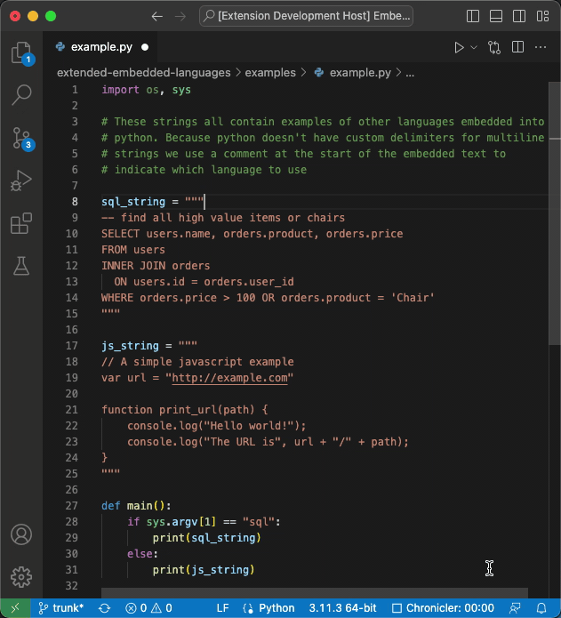
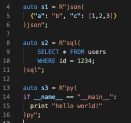
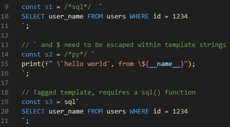
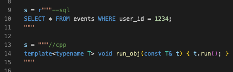
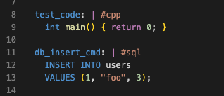
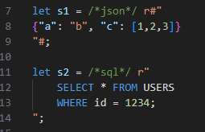

# Extended Embedded Languages

Adds syntax highlighting to C++, Javascript, Python, Rust and YAML for strings containing source code. Dozens of languages can be used within the strings such as SQL, HTML, CSS, GLSL, WSGL, LaTeX, JSON, YAML, and more.



This Visual Studio Code extension enables syntax highlighting _within_
strings that contain source code. For example, a Python script might
have strings containing SQL or HTML or Bash. This plugin will add
syntax highlighting, and additionally code folding and
language-specific editor features within those strings. 

This is similar to how you can select syntax highlighting within
Markdown documents using a language specifier (e.g. ` ```py `) or
switch between HTML, Javascript, and CSS in the same HTML document.


## Features

This plugin extends the syntax highlighting of several **host**
languages in order to highlight **embedded** sub-languages within
strings. 

You need to specify which language you are using within the string.
How this is done depends on the host language (see below). Once that
is done you can see and edit the embedded language just like you are
editing a standalone file using that language. For example if you are
editing SQL within a C++ document, the VSCode "Toggle Line Comment"
command will prefix lines with `--` not `//`. Code folding will use
the natural structure of the embedded language block too - collapsing
`<tags>` in an XML string, or `{` braces in a C string


---
## Host Language - C++

C++ uses _raw strings_ to specify the language. 

A raw string in C++ looks like 
```cpp
auto s = R"foo( ...text )foo";
```

Between the `"` and `(` an arbitrary token can be placed which we use
here to specify the language. This token needs to exist at the end of
the string as well:



---
## Host language - Javascript

Javascript template strings delimited by backticks (e.g. `` `...text...` ``) can be multiline. This extension supports two different ways to specify the language in a multiline template string.

As an inline comment before the beginning of the string:
```javascript
const s = /*lang_id*/ `
code goes here
`;
```

Or as a _tagged template_, this style expects there to be a function with the name of the language which can process the string (see the [tagged template documentation](https://developer.mozilla.org/en-US/docs/Web/JavaScript/Reference/Template_literals#tagged_templates) for 
examples and for an identity template which just returns the input string)
```javascript
const s = lang_id`
code goes here
`;
```




---
## Host language - Python

Python multiline strings do not have custom terminators the way C++,
Perl or other languages do. As such, we rely on _leading comments_ to
identify a language. This comment must be immediately after the `'''`
or `"""` which starts a multiline string




---
## Host language - YAML

YAML has block strings that begin with a `|` or `>` and continue based
on the indentation level of a block of text. Following the start
indicator you can put a comment (this is a *YAML* comment) which
indicates the language




---
## Host Language - Rust

Rust strings are all multiline. But for syntax embedding purposes we
use the multiline raw strings that begin with `r#"` (where there are
0-n `#` characters) and end with `"#`



---
## Embedded Languages

This extension supports a large number of embedded languages, listed
below. The "ID" column shows the IDs you can use in host languages like
C++ and YAML where you can specify an ID in the _host_ language. The
"Comment" column is for host languages like Python which have no way
to indicate the embedded language type directly, and shows what the
first characters of the _embedded_ language string needs to be to
signal which language you are using.

| Name                   | ID                           | Comment                                        |
| ---------------------- | ---------------------------- | ---------------------------------------------- |
| Batch                  | bat                          | `REM`, `@REM`, `::bat`                         |
| C                      | c                            | `/*c*/`                                        |
| C++                    | cpp, c++                     | `//cpp`, `//c++`                               |
| CSS                    | css                          | `/*css*/`                                      |
| GLSL                   | glsl                         | `//glsl`                                       |
| GraphQL                | graphql, gql                 | `#graphql`, `#gql`                             |
| Graphviz               | graphviz, dot                | `//graphviz`, `//dot`                          |
| HLSL                   | hlsl                         | `//hlsl`                                       |
| HTML                   | html                         | `<!DOCTYPE`, `<html`, `<!--html`               |
| Ini                    | ini                          | `;ini`                                         |
| Javascript             | js, javascript               | `//js`                                         |
| JSON                   | json                         | [^1]                                           |
| JSONC                  | jsonc                        | `//jsonc`                                      |
| LaTeX                  | latex                        | `%latex`                                       |
| Lua                    | lua                          | `--lua`                                        |
| Makefile               | makefile, make               | `#make`, `#makefile`, `#!/usr/bin/make`        |
| Metal shading language | metal                        | `//metal`                                      |
| Python                 | py, python                   | `#py`                                          |
| Shell                  | sh, bash, shell, shellscript | `#sh`, `#bash`, `#shell`, <br>`#!/bin/sh`, ... |
| SQL                    | sql                          | `--sql`                                        |
| TeX                    | text                         | `%tex`                                         |
| TOML                   | toml                         | `#toml`                                        |
| TypeScript             | typescript, ts               | `//typescript`, `//ts`                         |
| WGSL                   | wgsl                         | `//wgsl`                                       |
| XML                    | xml                          | `<?xml`, `<? xml`, `<!--xml`                   |
| YAML                   | yaml                         | `#yaml`                                        |


[^1]: JSON does not support comments, so there is no way to indicate a
  string is a JSON document within the string. 

## Developer Notes

See CONTRIBUTING.md for adding new languages


## Requirements


## Known Issues

* Syntax highlighting can leak past the end of the string when there are unclosed blocks (for example a `{` without a matching `}`). 
This is a limitation of the TextMate grammars that VSCode uses - when an _embedded_ syntax highlighter scans for the end of a text section it can scan past the end of the string. [VSCode issue 20488](https://github.com/microsoft/vscode/issues/20488) has a longer discussion on what is going on.

* Because of this same issue, some languages can't be embedded due to how they are defined. For example the most popular `csv` and `mermaid` highlighters will continue past the end of the string when they are embedded.

## Release Notes

### 1.1.0

Added Rust as a new host language. Updated documentation

### 1.0.0

Initial release of Extended Embedded Languages

